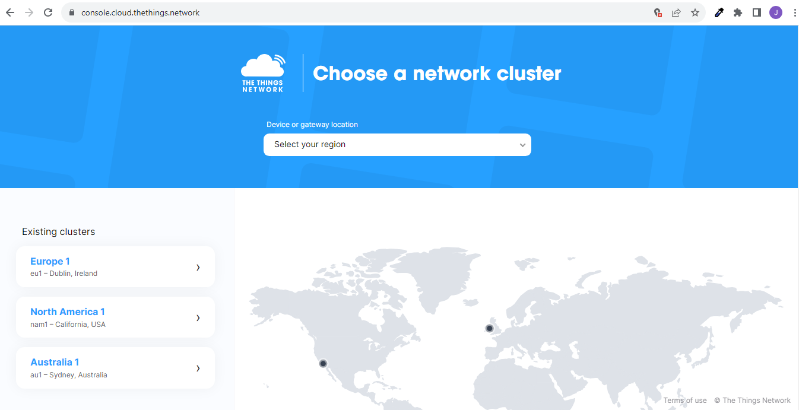
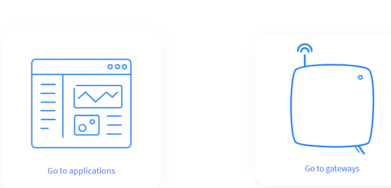
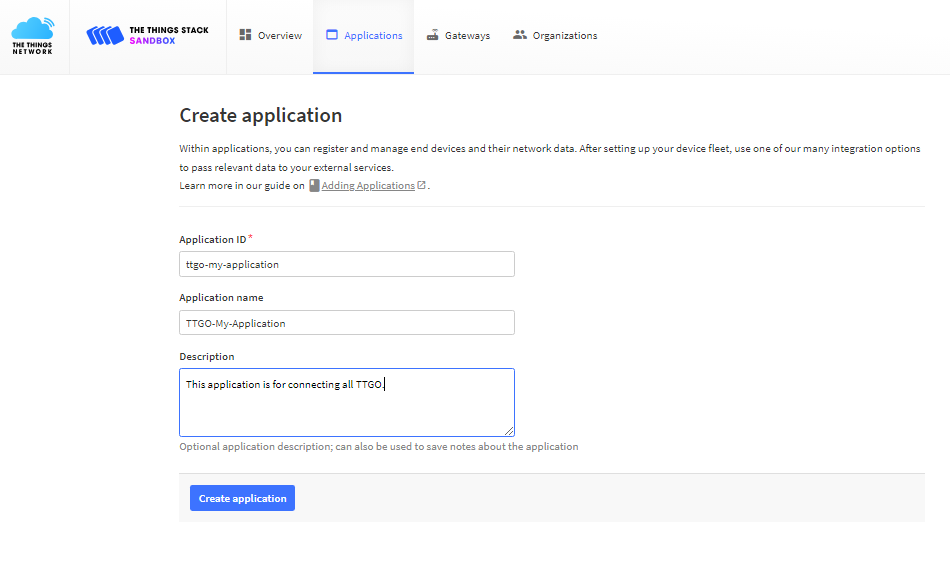
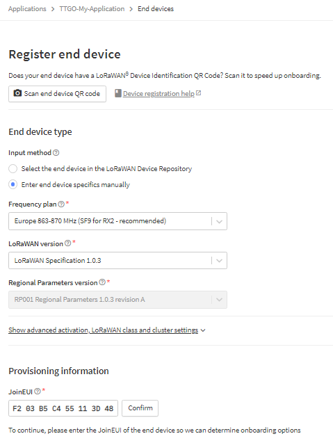
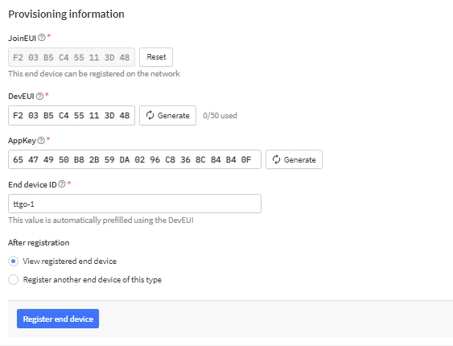
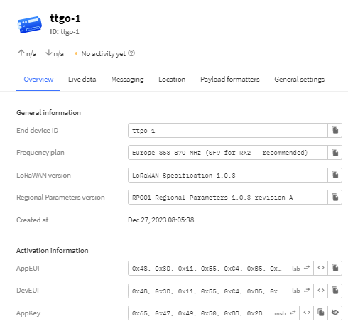
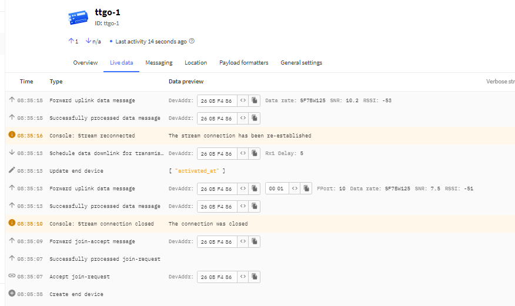

# TTN-Sandbox

This is an adaption to LMIC-node to explain how to stay within TTN-Sandbox regulations.

## Content

- [1. Fair Use Policy](##1.-fair-use-policy)
    - [1.1 Air Time Calculation](###1.1-air-time-calculation])
    - [1.2  Air Time Calculation via TTN JSON](###1.2-air-time-calculation-via-ttn-json)
- [2. RSSI](##2.-rssi)
    - [2.1 RSSI Test Environment](###2.1-rssi-test-environment)
    - [2.2 RSSI Production Environment](###2.2-rssi-production-environment)
- [3. Settings](##3.-settings)
    - [3.1 Board Selection](###3.1-board-selection)
    - [3.2 MCCI LoRaWAN LMIC library Settings](###3.2-mcci-lorawan-lmic-library-settings)
    - [3.3 Board Specific Settings](###3.3-board-specific-settings)
    - [3.4 LoRaWAN Keys](###3.4-lorawan-keys)
- [4. TTN Sandbox Settings](##4.-ttn-sandbox-settings)
    - [4.1 TTN Sandbox Application](###4.1-ttn-sandbox-application)
    - [4.2 TTN Sandbox Register end device](###4.2-ttn-sandbox-register-end-device)
    - [4.3 Compile and upload to TTGO](###4.3-compile-and-upload-to-ttgo)

## 1. Fair Use Policy

On The Things Network’s The Things Stack Sandbox a Fair Use Policy applies which limits the uplink airtime to 30 seconds per day (24 hours) per node and the downlink messages to 10 messages per day (24 hours) per node. If you use a private network, these limits do not apply, but you still have to be compliant with the governmental and LoRaWAN limits. https://www.thethingsnetwork.org/docs/lorawan/duty-cycle/#fair-use-policy

We will not discuss the legal requirements of your specific region, as this varies from region to region. And it is beyond the scope of this document.

### 1.1 Air Time Calculation

The air time is the time the node takes to transit the LoRaWAN packet

| Preamble  | PHDR | PHDR_CRC | PHYPayload | CRC |
| --- | --- | --- | ---| --- |

The convenient way to do this is to use https://avbentem.github.io/airtime-calculator/ttn/eu868/2 site.

Here we need to complete the region, overhead size and payload size.

If we assume you are using EU868, overhead of 13 bytes and a payload of 2 bytes. The node are fairly close to the gateway giving a good RSSI and low noise levels. The node can expect a SF7.

With these conditions met the node airtime will be 46.3ms for each uplink. The node will be allowed to transmit every 133.4s to keep in FUP

On the other hand, the node are still using EU868, overhead of 13 bytes and a payload of 2 byte. This time the node is far from the gateway, this will result in a low RSSI and possibly the SNR are also low. Now the node can expect an SF10.

With these conditions the node airtime will be 329.7ms for each uplink. The node will be allowed to transmit every 949.6s to keep in FUP

We have to also take into consideration that if the node is relevantly close to the gateway. The node can still experience a poor SNR resulting in a low SF like SF11. This will have an impact on the allowed transmit rate to keep within FUP.

With this mentored we are assuming the SF rate to calculate the rate of transmission to keep with in FUP.

### 1.2 Air Time Calculation via TTN JSON

Once we have our node configured on TTN and it joined the network. We can get the actual airtime form the JSON payload, there are a rich array other data we can actually extract, but lets us now get the actual airtime.

An example JSON as below.

```json
{
  "name": "as.up.data.forward",
  "time": "2023-12-26T10:43:46.697464008Z",
  "identifiers": [
    {
      "device_ids": {
        "device_id": "eui-3ae3400a2ac087e8",
        "application_ids": {
          "application_id": "xxxxx-xxxx-all"
        },
        "dev_eui": "3AE3400A2AC087E8",
        "join_eui": "3AE3400A2AC087E8",
        "dev_addr": "260B1904"
      }
    }
  ],
  "data": {
    "@type": "type.googleapis.com/ttn.lorawan.v3.ApplicationUp",
    "end_device_ids": {
      "device_id": "eui-3ae3400a2ac087e8",
      "application_ids": {
        "application_id": "xxxxx-xxxx-all"
      },
      "dev_eui": "3AE3400A2AC087E8",
      "join_eui": "3AE3400A2AC087E8",
      "dev_addr": "260B1904"
    },
    "correlation_ids": [
      "gs:uplink:01HERTJC5PZZ2EEDJ9TXJ78WK7"
    ],
    "received_at": "2023-12-26T10:43:46.692980925Z",
    "uplink_message": {
      "session_key_id": "AYyllhylXUv+0BuMArGkoQ==",
      "f_port": 10,
      "f_cnt": 1,
      "frm_payload": "AAI=",
      "decoded_payload": {},
      "decoded_payload_warnings": [
        "Unsupported fPort"
      ],
      "rx_metadata": [
        {
          "gateway_ids": {
            "gateway_id": "my-gateway-01",
            "eui": "09900000CA001055"
          },
          "timestamp": 480627523,
          "rssi": -49,
          "channel_rssi": -49,
          "snr": 9,
          "location": {
            "latitude": -1.25644,
            "longitude": 5.12255,
            "altitude": 615,
            "source": "SOURCE_REGISTRY"
          },
          "uplink_token": "ChwKGgoOb24tdGhlLWhpbGwtMDESCACAAACgABBPEMOWl+UBGgwI4tyqrAYQsfhy6AEguPuHvf6B/gE=",
          "received_at": "2023-12-26T10:43:46.391086023Z"
        }
      ],
      "settings": {
        "data_rate": {
          "lora": {
            "bandwidth": 125000,
            "spreading_factor": 7,
            "coding_rate": "4/5"
          }
        },
        "frequency": "868100000",
        "timestamp": 480627523
      },
      "received_at": "2023-12-26T10:43:46.487592044Z",
      "consumed_airtime": "0.046336s",
      "network_ids": {
        "net_id": "000013",
        "ns_id": "EC656E0000000181",
        "tenant_id": "ttn",
        "cluster_id": "eu1",
        "cluster_address": "eu1.cloud.thethings.network"
      }
    }
  },
  "correlation_ids": [
    "gs:uplink:01HpouJC5wer2EEDJ9TXJ78WK7"
  ],
```

I we look at the JSON path 

```
data.uplink_message.consumed_airtime
```

We can see the airtime is 0.046336s, we know from our setting that were are sending an uplink every 900s. From this we can calculate the total airtime.

This calculation is achieved by dividing 24 hours by transmit intervals of your node and multiplying this by the air time of each uplink (usually measured in seconds).

    Total airtime = (24*60*60) / Transmit Interval * consumed_airtime

Example:

If your uplink is every 900 seconds, using EU868, payload 2 bytes and SF7 BW125. The nodes airtime will be 46.336ms

Calculate total airtime

```
    Total airtime   = (24h*60m*60s) / 900s * 0.046336s
                     = 86400s / 900s * 0.046336s
                     = 4,448256 s
```

From the calculation we can see that the total air time we are consuming are well in the limits of FUP, our application are good to go.

The one factor we have not taken into consideration here is if the rssi or SNR deteriorates and the SF adjust to SF11 will we still be compliant?

For this we will refer back to the above mentioned site. We will see that the airtime for a SF11 message will increase to 659.5ms. Recalculate now and determine if we are within FUP

```
    Total airtime   = (24h*60m*60s) / 900s * 0.6595s
                     = 86400s / 900s * 0.6595s
                     = 63.312 s
```

Now we are well out of the FUP, to rectify this we need to adjust our Transmit Interval to 1900s for us to be compliant.

```
    Total airtime   = (24h*60m*60s) / 1900s * 0.6595s
                     = 86400s / 1900s * 0.6595s
                     = 29,9898 s
```

From the calculation we can see now we are within the FUP.

From this we can see we need to pay attention as to maintain our network optimally, ensure our node SF stays to the lower range. To enable us to get optimal out nodes rom a point of battery wise, airtime usage and for regularity of uplinks.

## 2. RSSI

### 2.1 RSSI Test Environment
When you are in your test environment, please ensure you have sufficient attenuation between your node and the gateway.

We recommend that the rssi needs to be -65 dBm to -100 dBm. This can be achieved by having a brick wall or other RF absorbing material between your node and gateway and a physical distance of 5-10m.

We have seen that if the rssi levels are the high and it causes channel bleed. When you are experiencing this you will see in the console the join request from the node. The node will receive the acknowledgment, but will be unable to interpret the message.

The node will continue to send join request and the node will be in continues loop trying to join the network. And will never be successful.

### 2.2 RSSI Production Environment
In the production environment we want to keep our nodes rssi and SNR as high as possible, this is so that the SF stay as low as possible. We want the nodes to connect at SF7 rather than SF8.

By achieve a lower SF we are lowering possibly the transmit power required, less time on the air and less battery usage. This will result in that our nodes will work longer on the same battery charge.

We still need to take care that the rssi is not the high as this will cause channel bleed, same as explained in 2.1 RSSI Test Environment.

## 3. Settings

### 3.1 Board Selection

In the platformio.ini we need to select the correct board as to the one we are going to use. I have a TTGO T-Beam V1 so this id the boar I will be using. Make sure you comment  the <platformio.ini board selector guard> and uncomment the appropriate board of your choice.

```ini
[platformio]
default_envs = 
    ;<platformio.ini board selector guard> Comment this line and uncomment one board-id below:

    ; LoRa development boards with integrated LoRa support:

    ; Board-id                            Board name
    ;---------                            ----------
    ; adafruit_feather_m0_lora          ; Adafruit Feather M0 LoRa
    ; disco_l072cz_lrwan1               ; Discovery B-L072Z-LRWAN1
    ; heltec_wifi_lora_32_v2            ; Heltec Wifi LoRa 32 V2
    ; heltec_wifi_lora_32               ; Heltec Wifi LoRa 32
    ; heltec_wireless_stick_lite        ; Heltec Wireless Stick Lite
    ; heltec_wireless_stick             ; Heltec Wireless Stick
    ; lopy4                             ; Pycom Lopy4
    ; lora32u4II                        ; BSFrance LoRa32u4 II v1.0, v1.1, v1.2, v1.3
    ; ttgo_lora32_v1                    ; TTGO LoRa32 v1.3
    ; ttgo_lora32_v2                    ; TTGO LoRa32 v2.0
    ; ttgo_lora32_v21                   ; TTGO LoRa32 v2.1.6
    ; ttgo_t_beam                       ; TTGO T-Beam v0.5, v0.6, v0.7
     ttgo_t_beam_v1                    ; TTGO T-Beam v1.0, v1.1

    ; Development boards that require an external SPI LoRa module:

    ; Board-id                            Board name
    ;---------                            ----------
    ; adafruit_qt_py_m0                 ; Adafruit QT Py    
    ; blackpill_f103c8_128k             ; Black Pill 128k
    ; blackpill_f103c8                  ; Black Pill  64k
    ; bluepill_f103c8_128k              ; Blue Pill 128k
    ; bluepill_f103c8                   ; Blue Pill  64k
    ; lolin_d32_pro                     ; Lolin D32 Pro
    ; lolin_d32                         ; Lolin D32
    ; lolin32                           ; Lolin32
    ; nodemcu_32s                       ; NodeMCU-32S
    ; nodemcuv2                         ; NodeMCU V2
    ; pico                              ; Raspberry Pi Pico
    ; pro8mhzatmega328                  ; Arduino Pro Mini 3.3V 8Mhz
    ; samd21_m0_mini                    ; SAMD21 M0-Mini
    ; teensylc                          ; Teensy LC
```

### 3.2 MCCI LoRaWAN LMIC library Settings
In the platformio.ini under the regional setting you need to select the correct frequency plan or your region, I am the 'EU868'. You will see that I have uncommented the appropriate plan.

```ini
    ; --- Regional settings -----
    ; Enable only one of the following regions:    
    ; -D CFG_as923=1
    ; -D CFG_as923jp=1   
    ; -D CFG_au915=1
    ; -D CFG_cn490=1                   ; Not yet supported
    ; -D CFG_cn783=1                   ; Not yet supported
    ; -D CFG_eu433=1                   ; Not yet supported
    -D CFG_eu868=1
    ; -D CFG_in866=1
    ; -D CFG_kr920=1
    ; -D CFG_us915=1

```

Want to give a word of caution here to the settings in US and AUS. Here I have seen a lot of mismatches between the gateway settings and the node. 

In the US TTN uses us915 FSB2, '-D CFG_us915=1' please ensure the gateway matches the settings on the node.

In AUS there are 3 different bands, so caution needed here as to the correct band to use. It will be one of '-D CFG_as923=1', -D CFG_as923jp=1 or -D CFG_au915=1. Dependant on the deployed of the gateway it possibly can be any of the 3. Lucky thought a number of community members deploying gateways use duel band ones. Supporting both as923 and au915 bands.

### 3.3 Board Specific Settings
In the platformio.ini all the available options you can set on each board are listed separately.

As indicated earlier we are using a TTGO T-Beam V1. We can adjust the serial port, power management, OLED use and the pins used.

I this example we are going to leave everything as default and just ensure the OLED are activated as we have one. We want to see some of the data from the network as the node joins and sending and receiving uplinks and downlinks.

```ini
[env:ttgo_t_beam_v1]
; TTGO T-Beam (aka T22) V1.0, V1.1 (ESP32).
; No onboard user LED. No display.
; Requires additional library and setup for AXP192 power management chip.
platform = espressif32
board = ttgo-t-beam
framework = arduino
upload_speed = 921600
monitor_speed = ${common.monitor_speed}
lib_deps =
    ${common.lib_deps}    
    ${mcci_lmic.lib_deps} 
    lewisxhe/AXP202X_Library     ; Power management chip library
build_flags =
    ${common.build_flags}
    ${esp32.build_flags}
    ${mcci_lmic.build_flags} 
    -D BSFILE=\"boards/bsf_ttgo_t_beam_v1.h\"
    -D MONITOR_SPEED=${common.monitor_speed}
    -D LMIC_PRINTF_TO=Serial    
    -D USE_SERIAL
    ; -D USE_LED                 ; NO ONBOARD USER LED CAN NOT USE THIS OPTION
    -D USE_DISPLAY              ; Requires external I2C OLED display  
```

### 3.4 LoRaWAN Keys
In the keys files folder there is a lorawan-keys_example.h, we need to copy this flie and name the new file lorawan-keys.h.

Here we need to specify the OTAA_DEVEUI, OTAA_APPEUI and OTAA_APPKEY keys since our example are going to be configured in the OTAA mode.

```cpp
// Keys required for OTAA activation:

// End-device Identifier (u1_t[8]) in lsb format
#define OTAA_DEVEUI 0xCE, 0xDE, 0xED, 0xCA, 0xAA, 0xFA, 0xED, 0xEE

// Application Identifier (u1_t[8]) in lsb format
#define OTAA_APPEUI 0xCE, 0xDE, 0xED, 0xCA, 0xAA, 0xFA, 0xED, 0xEE

// Application Key (u1_t[16]) in msb format
#define OTAA_APPKEY 0x0F, 0xB0, 0xD8, 0x0B, 0x80, 0x06, 0x0D, 0x00, 0x24, 0x01, 0x70, 0x1A, 0x00, 0x80, 0x6C, 0x0E
```

Here we need to pay attention to the order of the bytes. OTAA_DEVEUI and OTAA_APPEUI are both LSB format. And OTAA_APPKEY is in the MSB format.

## 4. TTN Sandbox Settings
If you don't have a TTN Sandbox account you will need to create one. https://www.thethingsnetwork.org/get-started?login

### 4.1 TTN Sandbox Application
Log in and select the console form the top right menu. Select the correct cluster for your project, there are 3 of eu1, nam1 and au1.

For my project I will select eu1 as that is the close to my location and will deliver the best performance. Or you can use the drop down menu and 'Select your region'



Select the 'Go to application'


Then select '+ Create application' at the top right. Here you need to complete the 'Application ID'(all lower case letters, numbers and dashes (-)), 'Application name' and 'Description'


### 4.2 TTN Sandbox Register end device
In the bottom right of your application select the '+ Register end device'.

There are several methods you can add a device, since our device is a custom one we need to select 'Enter end device specifics manually'.

The 'Frequency plan' needs to be 'Europe 863-870 MHz (SF9 for RX2 - recommended)', if you are in a different region select the appropriate one. It needs to match the selection you made 3.2 MCCI LoRaWAN LMIC library Settings.

The 'LoRaWAN version' will be 'LoRaWAN Specification 1.0.3'

The 'JoinEUI' can be generated using recommendations as per post in the TTN forum https://www.thethingsnetwork.org/forum/t/deveui-for-non-hardware-assigned-values/2093/23



The 'DevEUI' and the 'AppKey' can also be generated as the post mentioned above. You can specify your own 'End device ID'(all lower case letters, numbers and dashes (-)). And then you just need to select 'Register end device'


Now we can update the LoRaWAN keys as we discussed in 3.4 LoRaWAN Keys, need to pay attention to the format and LSB, MSB order of the bytes.

You can use the '<>' and the 'msb' 'lsb' to display and conveniently swap the order of the bytes.


### 4.3 Compile and upload to TTGO
Now we can connect the TTGO to the appropriate serial port, compile and upload the sketch to the TTGO.

**You should be up and running now**

Start the serial monitor and you will see the messages flow.


